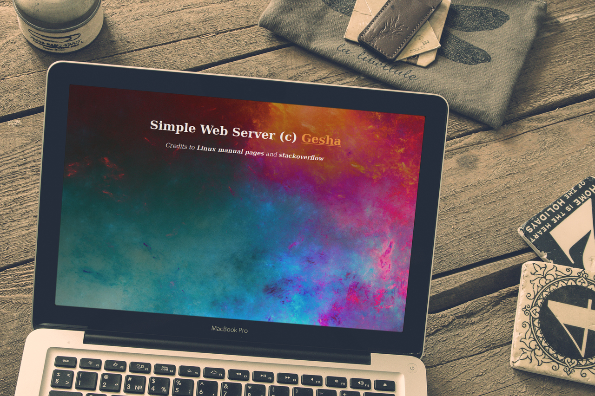

# MiniHTTP
Simple web-server, written in C language, which can handle HTTP requests and load a static web page. The web-server is accessible on port 9000 by default (you can assign port no. from the command line optionally). Current version supports only GET requests.
## How to use
- <b>index.php</b> and <b>/res</b> folder should be included into the folder with C program (<i>minihttp.c</i>);
- compile C program and run it from your terminal:
<pre>
gcc minihttp.c -o minihttp
./minihttp [PORT NO.]
</pre>
- the default request is considered as http://127.0.0.1:9000/index.php

  
View on <a href="http://www.gerayzade.az/dev/minihttp/" target="_blank">gerayzade.az</a>
